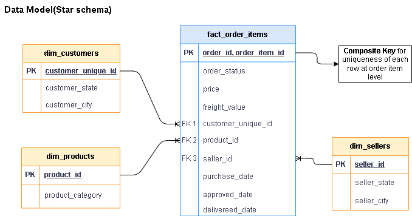
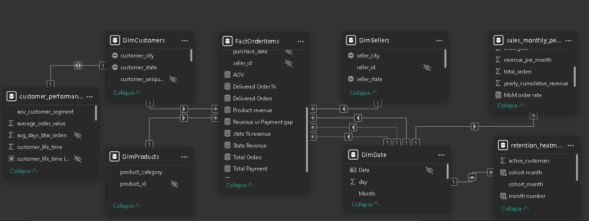
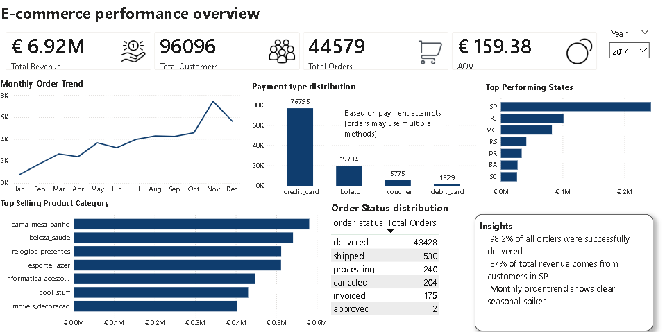
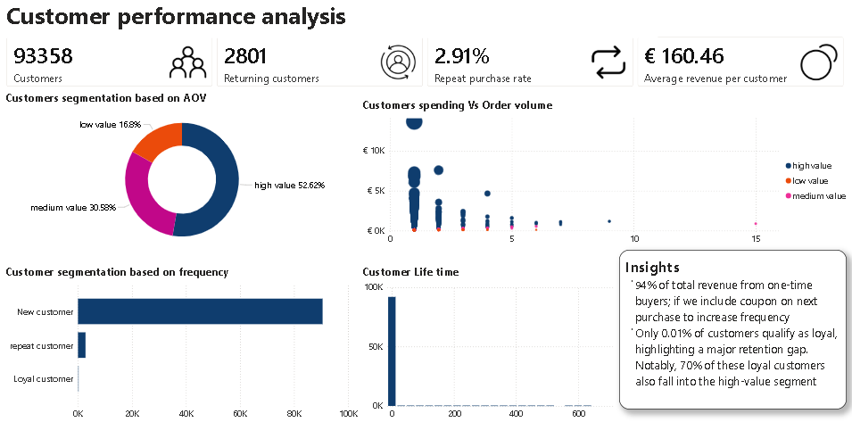
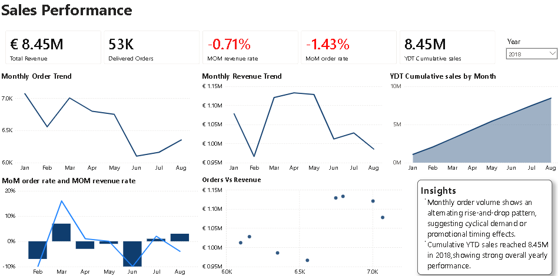
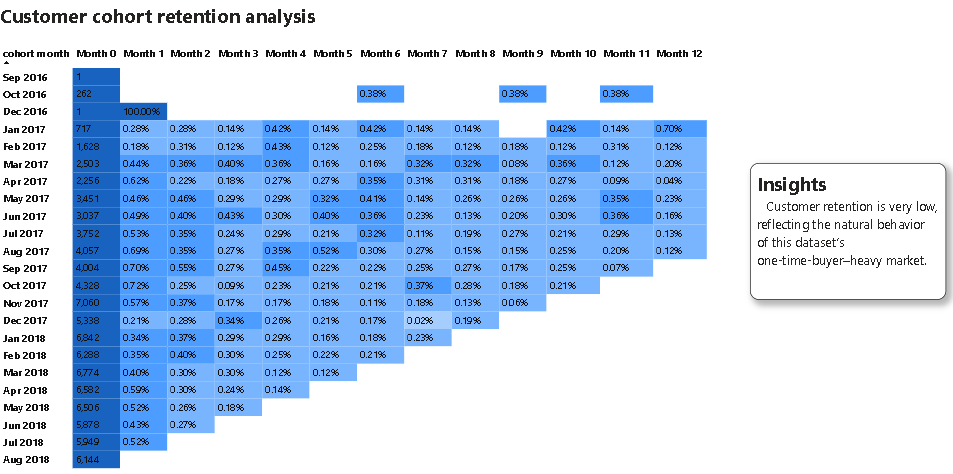

#  E‑Commerce Data Analysis – Olist Dataset

## Project Overview

This project analyzes the Olist Brazilian E‑Commerce dataset to uncover insights about sales performance, customer behavior, product trends, and retention.

The goal is to help an online marketplace understand what drives growth and where business opportunities exist.

As a data analyst, I performed data cleaning, SQL modeling, cohort analysis, RFM segmentation, and dashboard creation to answer key business questions.

## Business Questions
### Sales & Growth

- How are sales changing over time

- How are orders changing over time

- How is the business growing overall

### Customer Behavior

- Who are the most valuable customers

- Who are the most frequent customers

- Which drives growth more: high‑value purchases or frequent purchases

- How many customers return after their first purchase

- What is the month‑over‑month retention rate for each cohort

### Product Performance

- Which product categories generate the most revenue

- Which individual products generate the most revenue

## Dataset

Source: Olist Brazilian E‑Commerce Public Dataset

Tables used:

orders, customers, order\_items, products, sellers, payments

The dataset includes order details, customer demographics, product information, payments, and delivery performance.

## Tools Used

- SQL Server – data extraction,Modeling, joins, transformations and analysis

- Power BI – analysis, DAX, Visualization and dashboard

- Excel – data samples preparation and data dictionary preparation

- GitHub – documentation and version control

## Data Model(SQL)

### Star Schema Diagram 

### Tables Included
- fact_order_items  
- dim_customers  
- dim_products  
- dim_sellers  

### Key steps performed:

- Identified and resolved data duplication by defining correct data grain at the order-item level.

- Designed star schema data model with fact and dimension tables

- Joined tables using primary/foreign keys

- Corrected Month-over-Month growth logic for missing-month scenarios using chronological date sequencing

- Filtered delivered orders

- Standardized data types

- Calculated order value and delivery time

- Removed duplicates

- Created additional calculated fields for analysis

## Analysis Summary

### Sales Performance

- Monthly revenue and order trends analysed

- Calculated YTD cumulative revenue.
  
- Built monthly sales KPI dashboard with revenue and order trend analysis

Insight:

- Monthly order volume shows an alternating rise-and-drop pattern, suggesting cyclical demand or promotional timing effects.

- Cumulative YTD sales reached 8.45M in 2018,showing strong overall yearly performance

### Customer Analysis (RFM)

- Conducted RFM analysis to segment customers based on purchase frequency and spending.
  
- Built dashboard highlighting high value customers and purchasing behaviour.

Insight: 

- 94% of total revenue from one-time buyers; if we include coupon on next purchase to increase frequency

- Only 0.01% of customers qualify as loyal, highlighting a major retention gap. Notably, 70% of these loyal 
customers also fall into the high-value segment

### Retention Analysis (Cohort)

- Customers grouped by first purchase month

- Retention rate calculated month‑over‑month

Insight:

- Customer retention is very low, reflecting the natural behavior of this dataset’s one‑time‑buyer–heavy market.

### Product Performance

- Identified top categories and top products

Insight: A small number of categories dominate total revenue.

## Power BI analysis and visualization

### Tables Loaded into Power BI

#### **Fact Table**
- fact_order_items

#### **Dimension Tables**
- dim_customers  
- dim_products  
- dim_sellers

#### **Raw table**
 - order_payments(not part of schema only to show payment distribution across orders)

#### **Additional SQL Analysis Views (Used for KPIs Only)**
- sales_monthly_performance (used for MoM, YTD, KPI calculations)
- customer_peformnce (used for frquency segment,customer life time, KPI calculations)
- customer_cohort_retention_analysis(used for visualization)

### Table created in PowerBI 

#### **Dim Date**

 - DimDate(included in core star schema)

#### Why Additional SQL Views were created 

Extra SQL analysis views were created to:
- Pre‑calculate MoM, YTD metrics, Retention rate,customer lifetime,segmentation
- Improve performance by reducing DAX complexity  
- Ensure consistent KPI logic across Power BI visuals

These SQL analysis views are not part of the core star schema, but they are connected to the dimension tables in Power BI to support advanced KPIs (MoM, YTD, heatmaps, and performance metrics).

#### Why order_payments table loaded 

 - Not part of schema only to show payment distribution across orders in business overview

### Power BI Data Model

This project uses a star schema optimized for analytics.  

Below is the final Power BI model used for reporting:

###  Dashboard Pages

#### 1. E-Commerce overview

  
  
#### 2. Customer performance

  
  
#### 3. sales performance

  
  
#### 4.retention analysis

  

## Key Insights

- 98.2% of all orders were successfully delivered 

- 37% of total revenue comes from customers in SP

- Monthly order volume shows an alternating rise-and-drop pattern, suggesting cyclical demand or promotional timing effects.

- Customer retention is low

- A few product categories drive most sales

## Recommendations

- Strengthen customer retention strategies

- Focus on nurturing high‑value customers

- Promote and expand high‑performing categories

- Improve post‑purchase engagement to increase repeat orders

## Next Steps

- Hypothesis testing using python

- Interpret results with statistical measures.

- Expand analysis to seller performance and logistics

## Author

Pandeeswari Murugesan

Aspiring Data Analyst

